## Project overview  
This project aims to document the Catapult v3 SmartNIC cards that can be found occasionally on eBay.  
These cards seem to be used in several Microsoft projects and Azure servers.  
There are two variants of these cards:  
- PCI Express "standard" card format, codename `'Longs Peak'`
- Open Compute Project (OCP) Mezzanine card format, codename `'Dragontails Peak'`

Each of these SmartNIC features a large Arria 10 FPGA, 4 GB of DDR4-SDRAM, 128MB of flash memory for FPGA configuration, one Mellanox NIC ASIC, one QSFP+ port for 50Gb Ethernet connectivity, three 8x PCIe Gen3 interfaces, an onboard USB programmer and several LEDs.  
As usual in these strange pieces of hardware, it's hard to find any kind of documentation.

The main goal is to recycle these boards and use them as a cheap platform for FPGA learning and development from a hobbyist point of view.

## Hardware overview  
#### HW diagram  
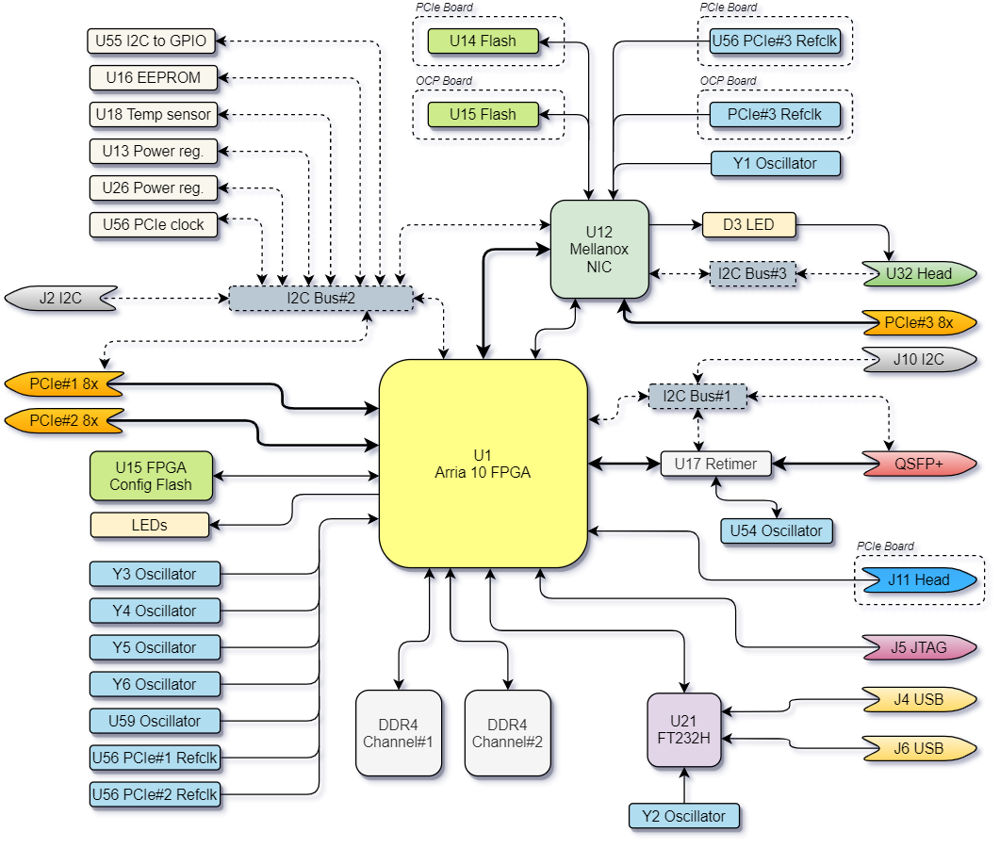  

Both variants share the same main hardware components with minor differences:  
- FPGA: Altera Arria 10 with non-standard P/N: `10AXF40GAA`.
- 1 Gb (128 MB) QSPI Flash memory for FPGA configuration: `Micron` `N25Q00AA`.
- Mellanox NIC ASIC.
  - `ConnectX-3 Pro` for the OCP version.
  - `ConnectX-4 Lx` for the PCIe version.
- 5 GB (4.5 GB usable) DDR4 SDRAM, organized as two independent 2.25 GB 72bit interfaces (64 data + 8 ECC): `SK hynix` `H5AN4G6NAFR-UHC`.
- Three I2C Busses.
  - Bus for U17 retimer and QSFP interface management.
  - Bus to manage the following parts: several power distribution components, I2C EEPROM, PCIe clock generation chip, I2C to GPIO chip, temperature sensor and Mellanox NIC ASIC.
  - Bus for Mellanox NIC ASIC management.
- Two independent 8x PCIe Gen3 interfaces for FPGA.
  - First interface is routed to the first 8x interface of PCIe bifurcation in SAMTEC connector (OCP board) and to 1-8 lanes of the PCIe edge (PCIe board).
  - Second interface is routed to an external connector J8 (OCP board) and to 9-16 lanes of the PCIe edge (PCIe board).
- One PCIe 8x Gen3 interface for Mellanox NIC ASIC, routed to the second 8x PCIe bifurcation in the SAMTEC connector (OCP board) and to the Oculink connector (PCIe board).
- One QSFP+ port connected to the FPGA through the U17 retimer.
- Onboard USB JTAG programmer based on `FTDI` `FT232H`.
- Several oscillators.
  - Five oscillators for FPGA.
  - One oscillator for Mellanox NIC ASIC.
  - One oscillator for U17 retimer `DS250DF810`.
  - One oscillator for FT232H.
  - One PCIe clock distribution chip.
- Several LEDs (9 of them accessible from the FPGA).
- Several external headers.
  - One I2C header for QSFP cable and retimer management.
  - One I2C header for power regulation components, PCIe clock  generation, EEPROM, temperature sensor, etc.  
  - ONE I2C header for Mellanox NIC ASIC management and LED status.
  - One header for JTAG connection using a standard Altera Blaster.
  - One header for FAN connector (Only present in PCIe variant).
  - One header with three GPIO pins wired to FPGA (Only present in PCIe variant).
  - One header with USB connection to FT232H onboard blaster (Muxed with external USB ports).
- External USB ports for FT232H on-board blaster.
  - Micro USB in the OCP variant.
  - USB type B in the PCIe variant.
- One unknown header with 2 pins.
- Miscellaneous discrete components (resistors, capacitors, level shifters, etc.).

## Current status  
At this moment the following tasks are accomplished:
- Identification of FPGA clock pins and frequencies (`Tested`).
- Identification of FPGA LEDs pins (`Tested`).
- Identification of three I2C buses.
  - Two buses for FPGA with identification of all the components attached to both buses (`Tested`).
  - One bus for Mellanox NIC ASIC external management (`Untested`).
- Identification of several GPIO/Unknown purpose pins in FPGA (`Untested`).
- Identification of PCI Express interfaces.
  - First 8x interface for FPGA (`Tested PCIe communication with computer using a simple design in both boards`).
  - Second 8x interface for FPGA (`Tested PCIe communication with computer using a simple design in both boards`).
  - 8x interface for Mellanox NIC ASIC (`Tested PCIe communication with PC in the OCP variant`).
- Identification of network interface pinouts.
  - QSFP cage pins to retimer (`Untested`).
  - Retimer to FPGA transceiver pins (`Untested`).
- Identification of two 72bit DDR4 interfaces (`Tested both channels in both boads`).
- Identification of FPGA transceiver pins for communication with Mellanox NIC ASIC (`Untested`).

The [FPGA_Pinouts](Documents/FPGA_Pinouts.xlsx) spreadsheet contains the FPGA pinouts and other findings.  
The [Header_Pinouts](Documents/Header_Pinouts.xlsx) spreadsheet contains the pinouts for the external headers.  
The [BOM](Documents/BOM.xlsx) spreadsheet contains a Bill of Materials for some ICs.  
The [GoldenTop](Projects/GoldenTop) project contains a simple Quartus design with a top level entity exposing all found FPGA pins.  

## TODO List  
The following tasks are pending:  
- Test/verify the untested tasks in previous point.  
- Test Ethernet connectivity.  
- Test FPGA communication to Mellanox NIC ASIC.  
- Test Mellanox NIC ASIC PCI Express connectivity in PCIe board via Oculink connector.  
- Incomplete or inaccurate constraints for already identified pins.  
- Find some remaining unknown/GPIO pins in FPGA.  
- Find the purpose of following components.  
  - U20 (Unknown, not found datasheet for this component).  
  - U55 (I2C to GPIO). Able to identify and manipulate this component through I2C bus, but unknown it's purpose.  
  - U22 (Level shifter with programmable I/O directions), unknown purpose of some pins, seems to communicate the FPGA with the Mellanox NIC ASIC.  
 This component interconnects several FPGA pins with Mellanox NIC ASIC.  
- Find the datasheet for some small components (maybe level shifters or voltage regulators?).  
- Create a complete documentation (PDF document, etc.).  
- Create a software interface to manage the devices attached to I2C bus.  

## Some notes  

#### About the contents in this repo  
There are the following folders in this repo:  
- **Documents**: Contains several subfolders with pictures, datasheets, spreadsheets, etc.  
- **Projects**: Contains the Quartus projects organized in subfolders for each category.  
Some projects have a `'Software'` subfolder containing the NIOS II EDS projects with the apps and bsp to be used in conjunction with the hardware project.

#### About the hardware components  
- The FPGA P/N `10AXF40GAA` isn't listed in the Arria 10 datasheets and seems to use a non-standard nomenclature pattern.  
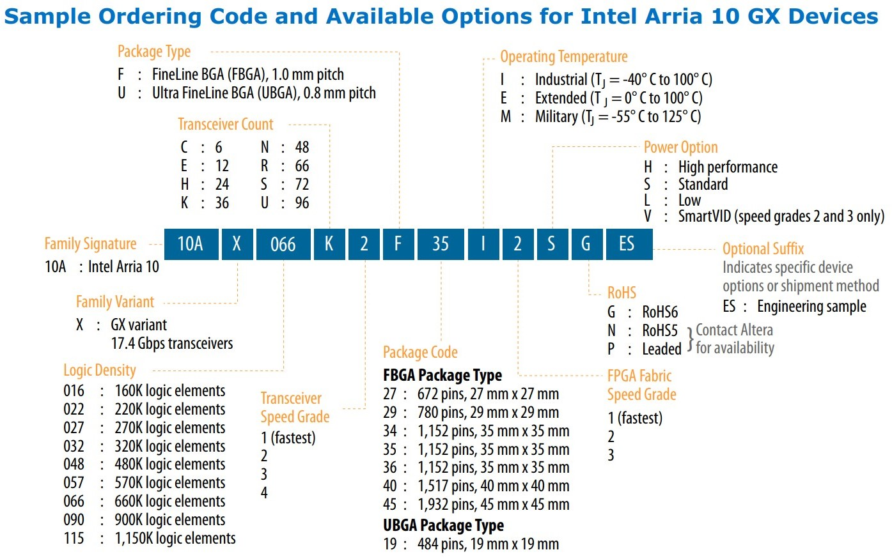  
According to [this](https://twitter.com/rombik_su/status/1341125492884332549) [@rombik_su](https://twitter.com/rombik_su) twitter thread, this device is identical to `10AX115N4F40E3SG`, also the Quartus device properties window reports the same characteristics.  
However, there are [some pictures](https://www.nextplatform.com/2020/02/03/vertical-integration-is-eating-the-datacenter-part-two/) for the OCP card mounting this P/N `10AX090N3F40E2SG`.  
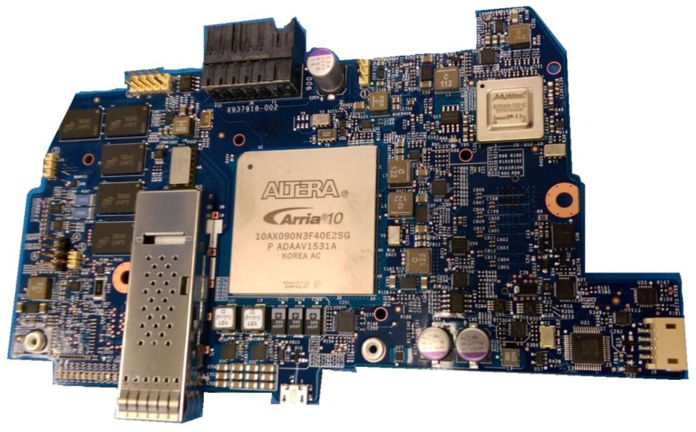  
Also, in this picture, some components such as Y4 oscillator is missing, this clock is supposed that drives the DDR4 interface on the top side, maybe this is another variant of these cards.  
Anyways, Quartus is able to generate the bitstreams for the `10AXF40GAA` and this strange Arria 10 device seems to accept all of them (`10AXF40GAA`, `10AX115N4F40E3SG` or `10AX090N3F40E2SG`)
- It seems that the PCIe version have a better Mellanox NIC ASIC hardware: ConnectX 3Pro vs ConnectX 4Lx.  
ConnectX 3Pro is 40GbE capable and ConnectX 4Lx is 50GbE.
- Although the amount of RAM is 5GB only 4.5GB are usable. One of the chips of each channel has only 8 bits wired to the FPGA.  
- Unable to find any documentation for the PCIe side connector J8 in OCP card, only the SAMTEC bottom connector appears in the OCP documents, this one seems to be a proprietary connection. It carries 16 pairs of lanes with differential signals for PCIe (8Rx + 8Tx), once PCIe reset signal (PERST_N) and one cable detection pin.
- FPGA oscillator Y6 is 644.53125 MHz for PCIe card and 156.250 MHz for OCP card. This oscillator is supposed that clocks the FPGA communication with the Mellanox NIC ASIC. This makes sense that ConnectX 3 has a lower speed for interconnect with FPGA (maybe 40GbE or 10GbE?).
- Unable to use the dedicated JTAG header (J5) to program the FPGA on any of the cards, Quartus Programmer reports JTAG chain errors, other tools are unable to detect any device.

#### About the use of Quartus programmer and tools with the onboard USB programmer  
When connected to a computer via USB, these boards are recognized as standard FTDI COM ports.  
Even though some tools such TopJTAG Probe or OpenOCD allows to use the FTDI ports as JTAG programmers, the Quartus tools doesn't recognize these devices as valid programming hardware.  
The following options are reliable to make Quartus tools work:  
 - Jan Marjanovič's project https://github.com/j-marjanovic/jtag-quartus-ft232h, allows using the FT232H as a JTAG interface for use with Quartus tools in Linux environments.  
 - Applying a small patch to the [Arrow USB Programmer](https://shop.trenz-electronic.de/Download/?path=Trenz_Electronic/Software/Drivers/Arrow_USB_Programmer) lib/dll allows any FTDI chip that implements the MPSSE protocol such as FT2232D, FT2232H, FT4232H or FT232H to be used as USB Blaster by Quartus tools in Windows or Linux environments.  

Anyways, a standard Altera USB Blaster connected on the J5 Header works like a charm. Note that some cheap USB Blaster clones doest work in these boards.  

## Some pictures

#### `Dragontails Peak` top view  
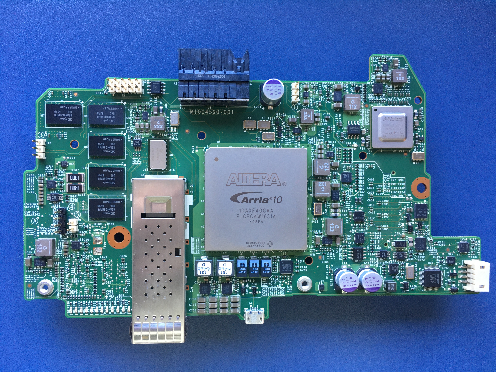  

#### `Dragontails Peak` bottom view  
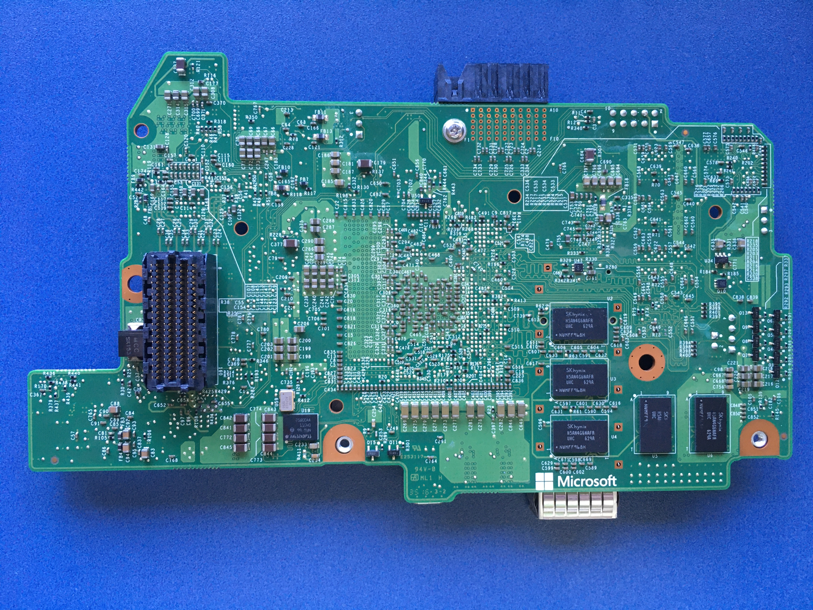  

#### `Longs Peak` top view  
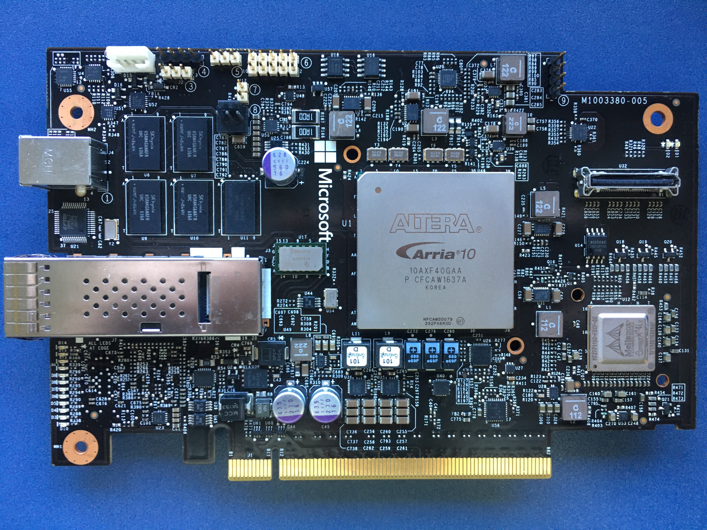  

#### `Longs Peak` bottom view  
  

#### Some FPGA info  
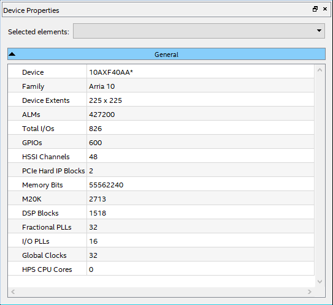  

#### Quartus JTAG scan and EPCQ FPGA configuration memory dump  
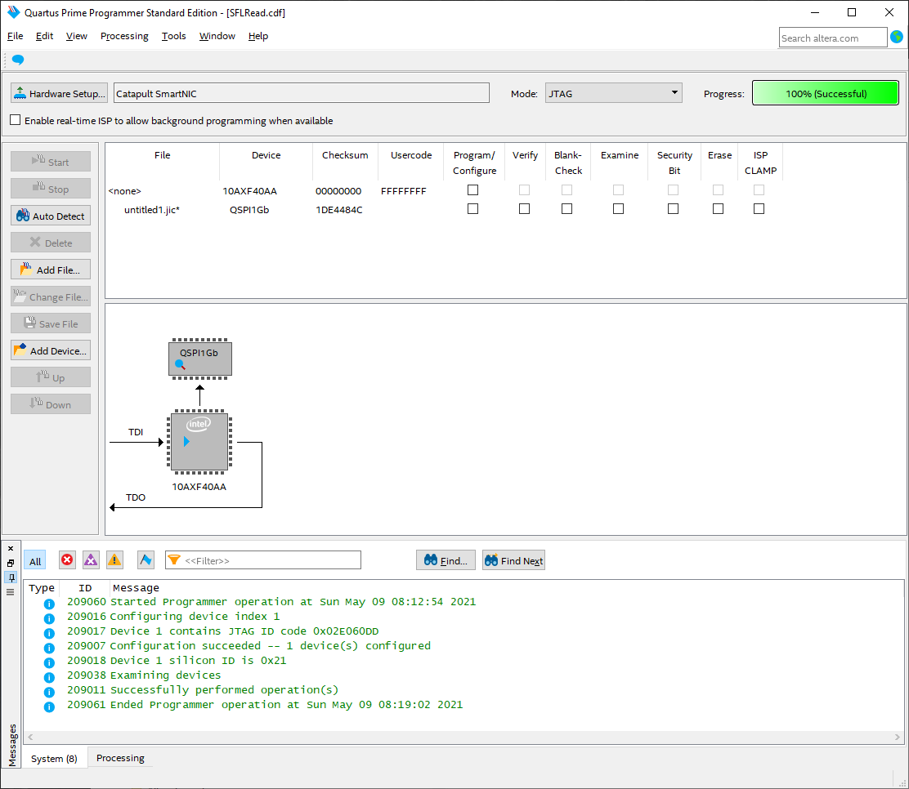  

#### Quartus PIN Planner  
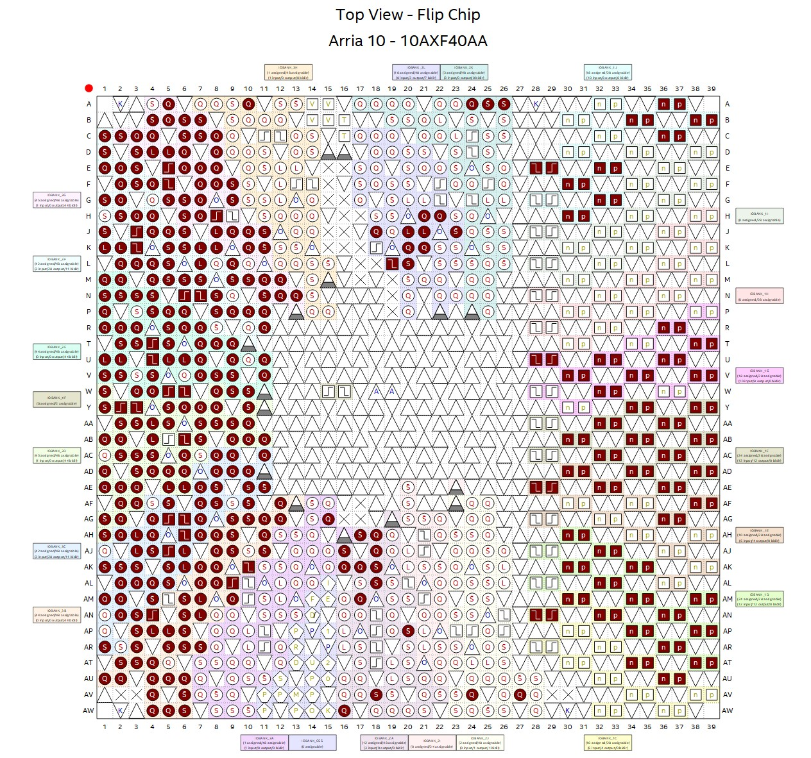  

#### Quartus EMIF Toolkit checking the top side DDR4 interface  
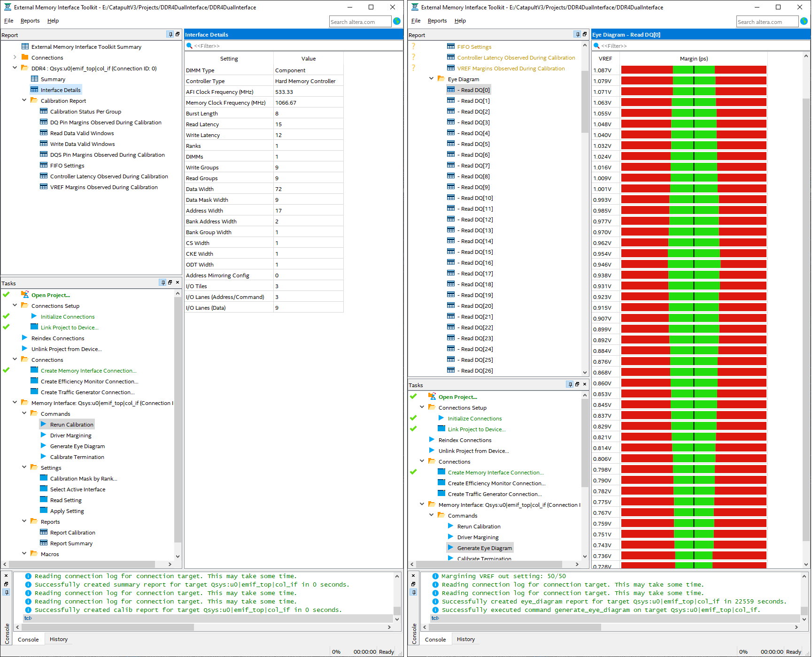  

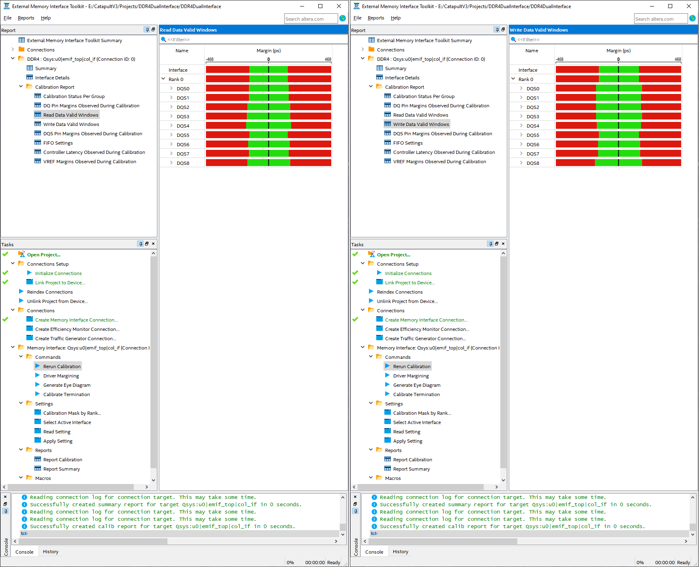  

#### I2C Bus scan  
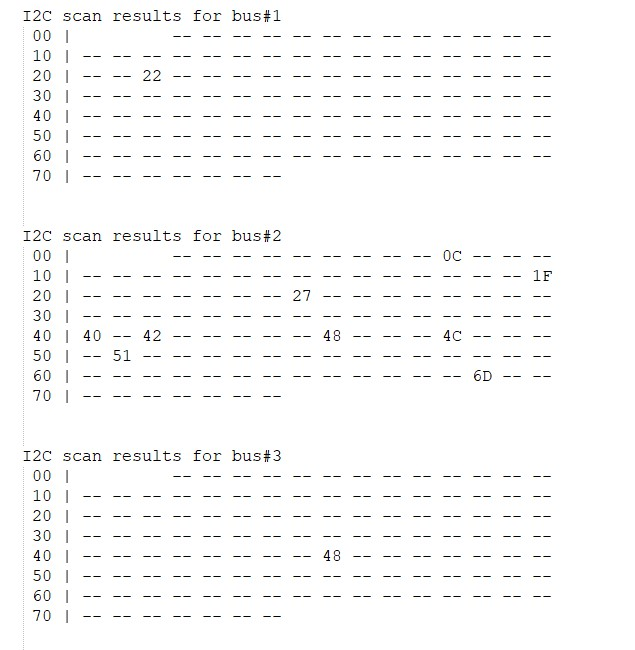  

#### Testing the three PCI Express interfaces in the OCP board
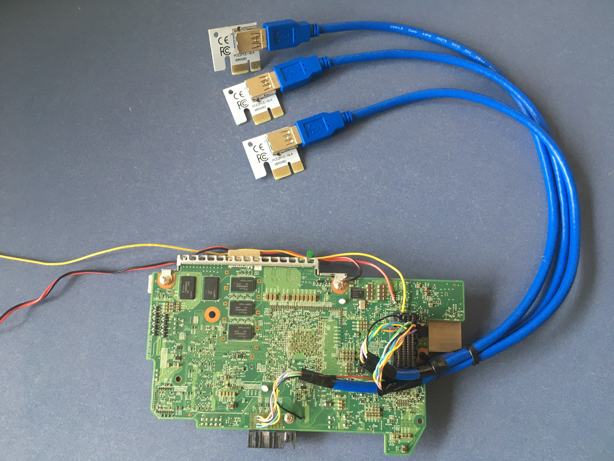

#### Basic PCI Express project with two PCIe interfaces  
The custom PCIe devices detected by Windows device manager using the Altera PCI API Driver.  

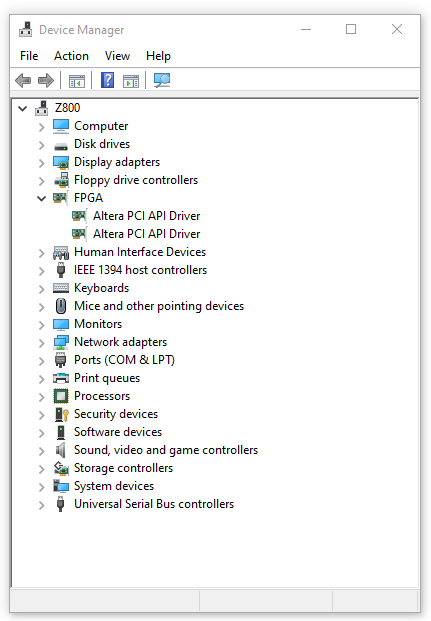  

RW Everything tool writing a `01010101` pattern on BAR1 base address of the first PCIe device, at this memory address is mapped an Avalon PIO core wired to the LEDs.  

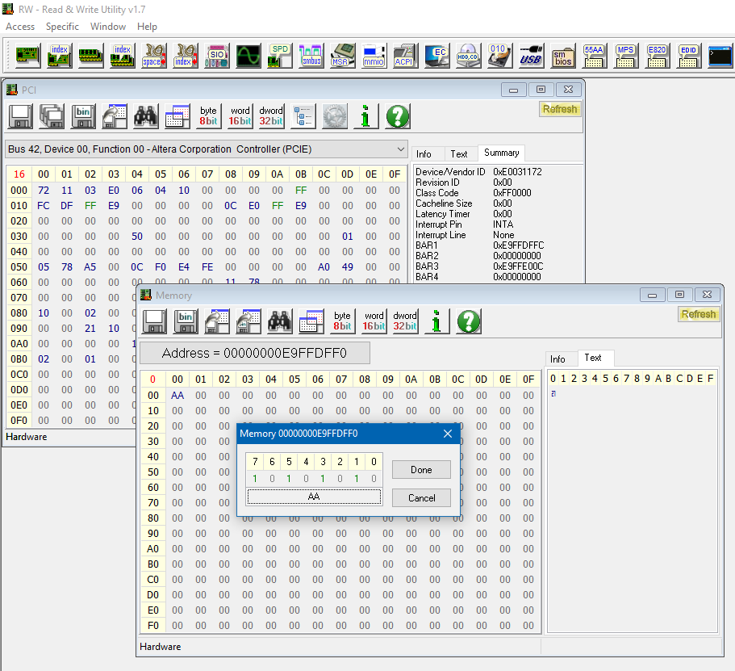

The green LEDs displaying the `01010101` pattern.  

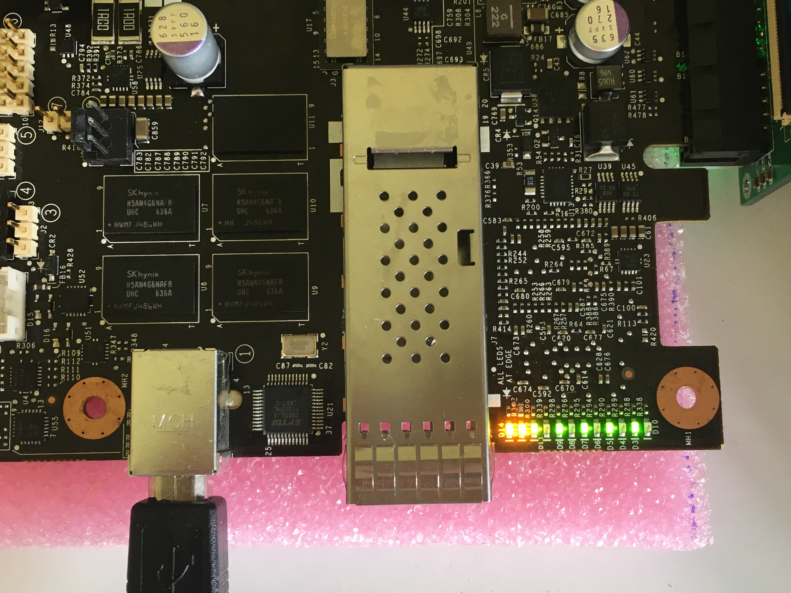  

## External resources
There are some online resources mentioning these boards or the previous generation boards (Catapult v2)  
- Some twitter threads by [@rombik_su](https://twitter.com/rombik_su) about these cards
  - https://twitter.com/rombik_su/status/1340975050665701378  
  - https://twitter.com/rombik_su/status/1359232759823298564
- [Jan Marjanovič](https://twitter.com/janmarjanovic)'s awesome blog and GitHub repos for Catapult v2
  - https://j-marjanovic.io/stratix-v-accelerator-card-from-ebay.html  
  - https://github.com/j-marjanovic/otma-fpga-bringup
  - https://github.com/j-marjanovic/ocs-tray-mezzanine-adapter  
  - https://github.com/j-marjanovic/jtag-quartus-ft232h  
- [wirebond](https://github.com/wirebond)'s GitHub repo for Catapult v2
  - https://github.com/wirebond/catapult_v2_pikes_peak
- [MorriganR](https://github.com/MorriganR)'s GitHub repo for Catapult v2  
  - https://github.com/MorriganR/Microsoft-Catapult-DDR3L-pinout
- [@occamlab](https://twitter.com/occamlab)'s blog for Catapult v2
  - http://virtlab.occamlab.com/home/zapisnik/microsoft-catapult-v2
- Open Compute Project documents  
  - https://www.opencompute.org/wiki/Server/ProjectOlympus  
  - https://www.opencompute.org/documents/microsoft-ocs-v2-chassis  
  - https://www.opencompute.org/documents/microsoft-ocs-v2-tray-mezzanine   
- Some PDFs  
  - https://www.microsoft.com/en-us/research/uploads/prod/2018/03/Azure_SmartNIC_NSDI_2018.pdf
  - https://www.nextplatform.com/2020/02/03/vertical-integration-is-eating-the-datacenter-part-two/
  - https://indico.cern.ch/event/822126/contributions/3500184/attachments/1906428/3148591/Catapult_FastML_Fermilab_2019.pdf
  - http://files.opencompute.org/oc/public.php?service=files&t=5803e581b55e90e51669410559b91169&download&path=/SmartNIC%20OCP%202016.pdf

## Disclaimer
All trademarks mentioned in this project are the property of their respective owners.  
This project has no commercial purpose.
